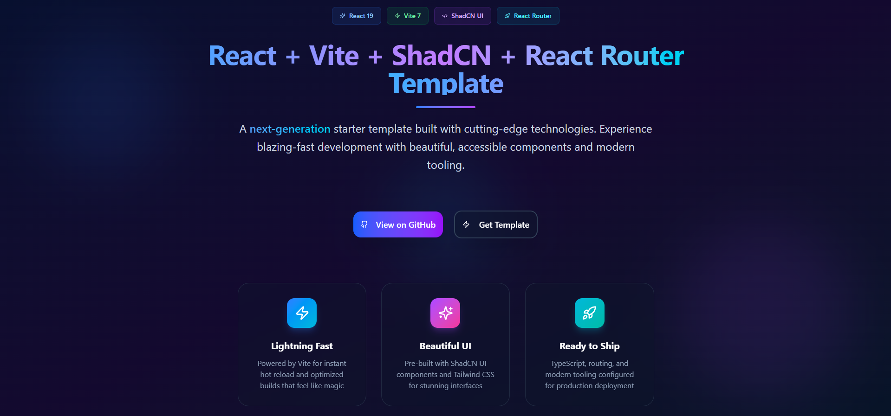

# React Vite ShadCN Template

## 📄 Description (English)
This project is a modern starter template for web applications built with React, Vite, ShadCN UI, React Router, and TailwindCSS. It provides a solid and scalable foundation to kickstart new projects with best practices and ready-to-use styled components.



## 🚀 Technologies Used
- ⚛️ React  
- ⚡ Vite  
- 🎨 ShadCN UI  
- 🌐 React Router  
- 💨 TailwindCSS

## 📦 How to Clone and Install
```bash
git clone https://github.com/your-username/react-vite-shadcn-template.git
cd react-vite-shadcn-template
npm install
```

## 🧪 How to Run in Development
```bash
npm run dev
```

## ☁️ How to Deploy on Vercel
Make sure you have an account at Vercel.

Import this repository from the Vercel dashboard.

Adjust the settings if needed (environment variables, build command, etc.).

Click on Deploy.

## 👤 Credits
Developed by @lobatoabrahan.

## 📄 License
This project is licensed under the MIT License. See the LICENSE file for details.

## 📄 Descripción (Español)
Este proyecto es una plantilla moderna para aplicaciones web construida con React, Vite, ShadCN UI, React Router y TailwindCSS. Proporciona una base sólida y escalable para comenzar nuevos proyectos con buenas prácticas y componentes estilizados listos para usar.


## 🚀 Tecnologías utilizadas
- ⚛️ React  
- ⚡ Vite  
- 🎨 ShadCN UI  
- 🌐 React Router  
- 💨 TailwindCSS

## 📦 Cómo clonar e instalar
```bash
git clone https://github.com/lobatoabrahan/template-vite-react-typescript-shadcn-router.git
cd react-vite-shadcn-template
npm install
```

## 🧪 Cómo ejecutar en desarrollo
```bash
bash
Copiar
Editar
npm run dev
```

## ☁️ Cómo desplegar en Vercel
Asegúrate de tener una cuenta en Vercel.

Importa este repositorio desde el panel de Vercel.

Configura los ajustes si es necesario (entorno, build command, etc.).

Haz clic en Deploy.

## 👤 Créditos
Desarrollado por @lobatoabrahan.

## 📄 Licencia
Este proyecto está bajo la licencia MIT. Consulta el archivo LICENSE para más información.

React Vite ShadCN Template